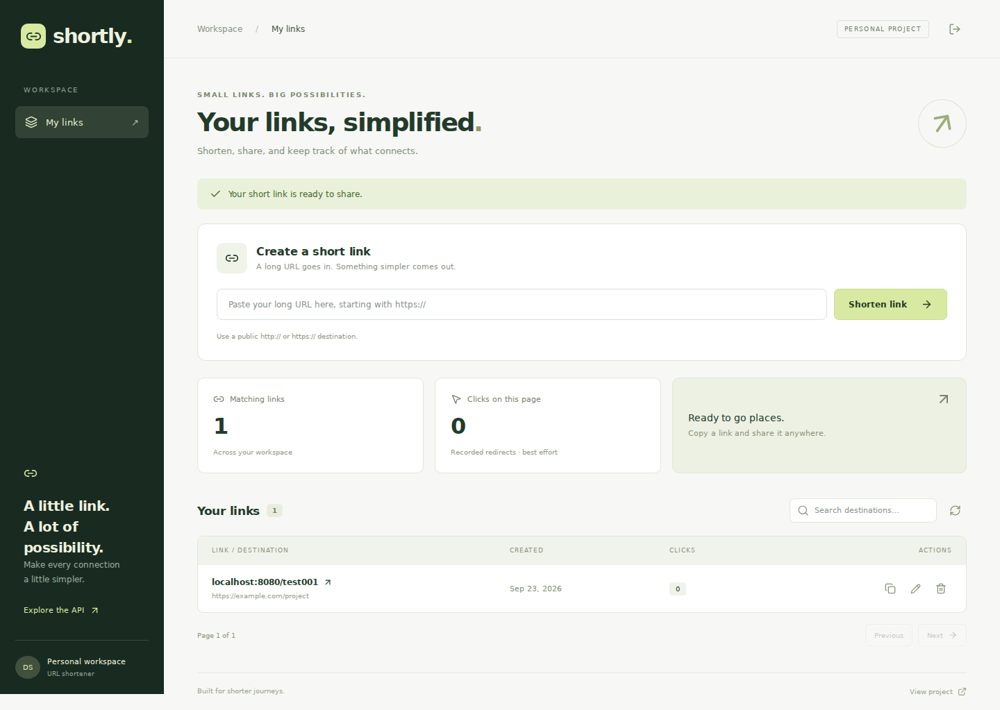
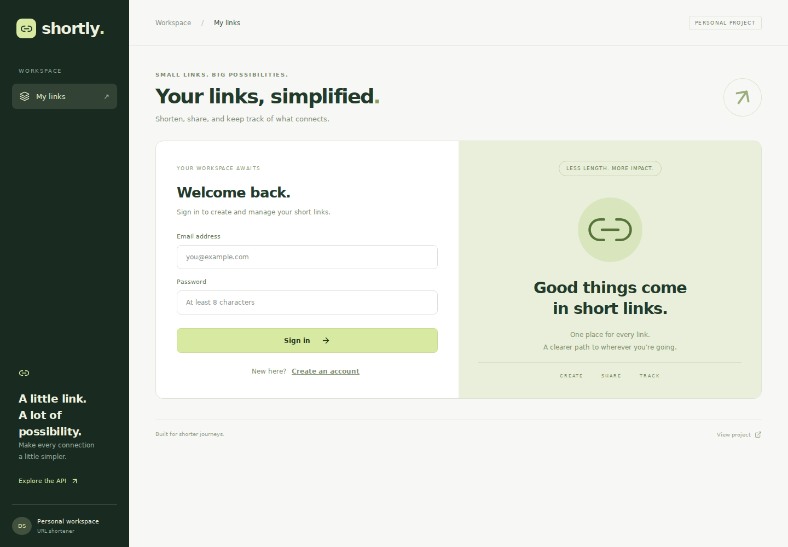
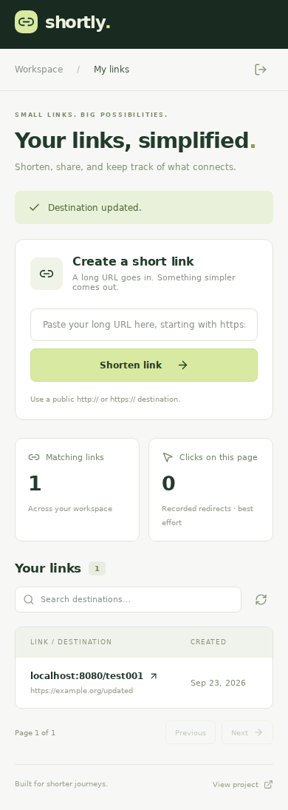
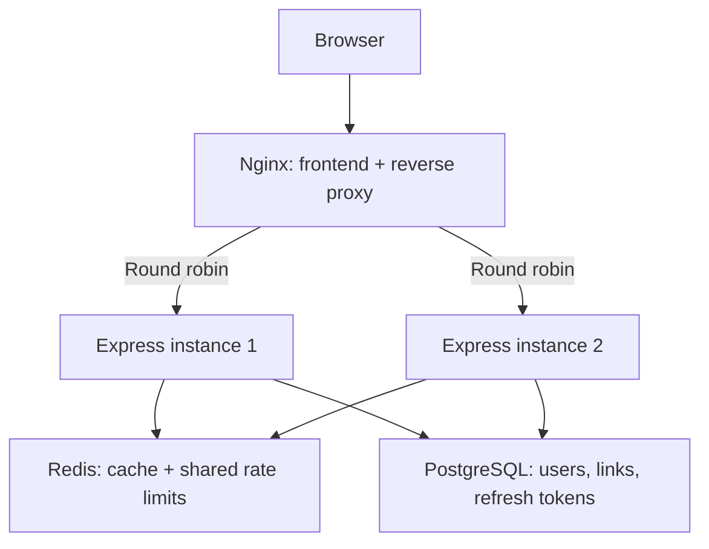
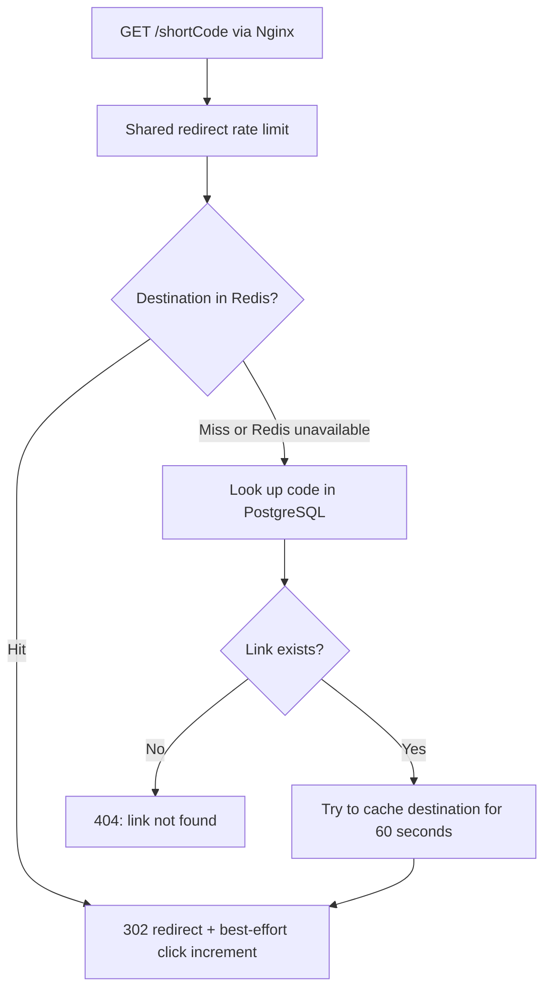
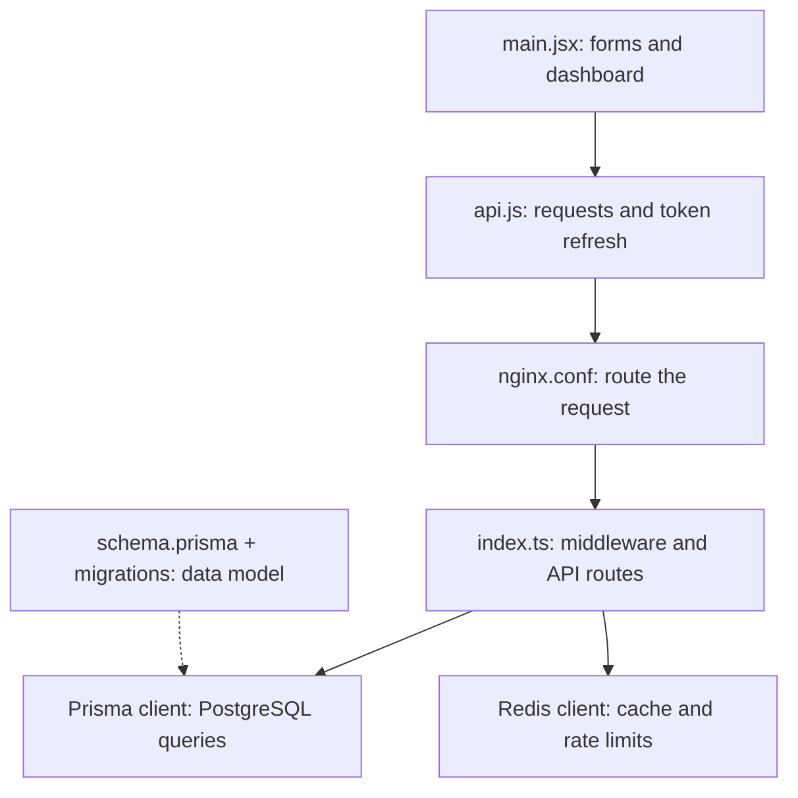

<div align="center">

# Shortly

### Short links. Shared state. Two backend instances.

A full-stack URL shortener with a React dashboard, authenticated link management, Redis caching, and Nginx load balancing.

**React · Express · TypeScript · PostgreSQL · Prisma · Redis · Nginx · Docker**

[Quick start](#quick-start) · [Architecture](#architecture) · [How it works](#how-it-works) · [Code map](#code-map) · [Run the HLD demo](#run-the-hld-demo)

</div>



## What is Shortly?

Shortly turns long URLs into short, shareable links. Users can create an account, manage their destinations, and see how often their links are opened. Visitors can open a short link without signing in.

Beyond the UI, the project implements a small system-design architecture: **two identical Express instances behind Nginx**, sharing PostgreSQL for durable data and Redis for cache entries and rate limits. It makes concepts such as horizontal scaling, cache-aside reads, token rotation, and failure handling tangible through working code.

**Example:** a destination such as `https://example.com/articles/system-design?source=portfolio` becomes `http://localhost:8080/aB12xyZ` in local development. Opening the short link redirects the browser to the original destination.

> **Deployment scope:** the included Docker Compose setup runs on one machine. Two API containers demonstrate load balancing and application-instance failover; they do not provide protection against that machine failing. The screenshots show local development with sample data.

## Features

| For users | Under the hood |
| --- | --- |
| Register, sign in, and sign out | bcrypt password hashing, JWT access tokens, rotating refresh tokens |
| Create and copy short links | Seven-character random Base62 codes with uniqueness enforced by PostgreSQL |
| Search and paginate saved links | Owner-scoped queries and a composite owner/date index |
| Change destinations or delete links | Ownership checks and Redis cache invalidation |
| Open public short links | Cache-aside lookup, HTTP 302 redirects, and `Cache-Control: no-store` |
| View per-link click counts | Asynchronous, best-effort database increments |
| Use the dashboard on mobile | Responsive layouts, loading states, errors, and confirmation dialogs |

## A closer look

<details>
<summary><strong>Account access — login and registration</strong></summary>



Users sign in to their own workspace. Link creation, editing, and deletion require authentication; public redirects do not.

</details>

<details>
<summary><strong>Mobile dashboard</strong></summary>



The dashboard adapts to small screens. The link table scrolls horizontally to keep destinations and actions accessible.

</details>

## Architecture



- **Nginx** serves the built React files and forwards API/short-link requests to the backends. It uses round robin and passive failure detection.
- **Express** validates requests, verifies authentication, manages links, and issues redirects. Both instances run the same code and share the JWT signing secret.
- **PostgreSQL** is the durable source of truth. Its named Docker volume preserves data across container replacement.
- **Redis** stores temporary destination mappings and per-IP request counters shared by both instances.
- **Docker Compose** starts the services, waits for dependencies, and runs Prisma migrations before starting the APIs.

**Why no sticky sessions?** A user can log in through instance 1 and send their next request to instance 2. JWT verification uses the same secret, refresh tokens live in PostgreSQL, and rate limits live in Redis. Authentication does not depend on which instance received the previous request.

## How it works

### 1. Create a short link

1. The React form collects a destination and calls `api('/urls', ...)`.
2. The API wrapper sends `POST /api/urls` with the access token.
3. Nginx forwards the request to one backend instance.
4. Express applies the shared rate limit, verifies the JWT, and validates the HTTP/HTTPS destination.
5. The backend generates a random seven-character Base62 code and inserts the mapping into PostgreSQL. A unique constraint catches collisions; allocation retries up to five times.
6. The response includes a short URL built from `BASE_URL`. React reloads the user's link list.

**Code path:** [main.jsx](frontend/src/main.jsx) → [api.js](frontend/src/api.js) → [nginx.conf](frontend/nginx.conf) → [index.ts](backend/src/index.ts) → PostgreSQL through [Prisma](backend/prisma/schema.prisma).

### 2. Open a short link



On a cache hit, the destination lookup avoids a PostgreSQL read. A click still triggers an asynchronous database write. The browser receives a `Location` header and visits the destination itself; the backend does not fetch the destination page.

The response uses **302 with `Cache-Control: no-store`** so subsequent navigations return to the shortener, allowing destination changes and click tracking.

### 3. Refresh a session

Passwords are hashed with bcrypt. Login returns a **15-minute access token** and a **seven-day refresh token**. Only a SHA-256 hash of the refresh token is stored in PostgreSQL.

When a protected request returns 401, `api.js` attempts one refresh and retries the request. A shared in-flight promise prevents simultaneous requests in the same tab from starting separate refreshes. On the server, a transaction consumes the old token and creates its replacement; concurrent attempts cannot both consume the same token.

### 4. Edit or delete a link

Express verifies that the requester owns the link, updates PostgreSQL, and attempts to delete the cached destination. The UI then refreshes its list. Cache invalidation is best effort: Redis outages or overlapping cache fills can leave an older destination until its TTL expires.

## Code map

### Frontend-to-backend file flow



The schema defines the models used by the generated Prisma client. Requests do not execute the schema file directly.

| File | What to read it for |
| --- | --- |
| [`frontend/src/main.jsx`](frontend/src/main.jsx) | Forms, authentication screens, dashboard state, search, pagination, edit/delete dialogs |
| [`frontend/src/api.js`](frontend/src/api.js) | HTTP calls, Authorization headers, session storage, automatic token refresh |
| [`frontend/src/style.css`](frontend/src/style.css) | Desktop/mobile layout and component styling |
| [`frontend/vite.config.js`](frontend/vite.config.js) | Development-only proxy for API requests |
| [`frontend/nginx.conf`](frontend/nginx.conf) | Static frontend serving, upstream servers, round robin, forwarded IPs, failover |
| [`backend/src/index.ts`](backend/src/index.ts) | Express middleware, auth, link CRUD, Redis operations, redirects, errors, shutdown |
| [`backend/src/swagger.ts`](backend/src/swagger.ts) | Interactive API reference |
| [`backend/prisma/schema.prisma`](backend/prisma/schema.prisma) | User, Url, and RefreshToken models, relations, indexes |
| [`backend/prisma/migrations/`](backend/prisma/migrations/) | Versioned database schema changes |
| [`docker-compose.yml`](docker-compose.yml) | Services, private network, environment variables, health checks, persistent volume |
| [`backend/Dockerfile`](backend/Dockerfile) / [`frontend/Dockerfile`](frontend/Dockerfile) | Backend compilation and frontend build/serving images |
| [`scripts/smoke.mjs`](scripts/smoke.mjs) | API integration checks against a running stack |
| [`.github/workflows/verify.yml`](.github/workflows/verify.yml) | Container build, integration checks, and backend-failover check |
| [`deploy/`](deploy/) | Optional HTTPS configuration for a Linux server |

The backend deliberately keeps the small application's routes in one file with named sections, rather than adding unnecessary service layers.

## Data model

| Model | Important fields | Purpose |
| --- | --- | --- |
| `User` | `id`, unique `email`, hashed `password`, `createdAt` | Account identity; owns links and refresh tokens |
| `Url` | `id`, unique `shortCode`, `longUrl`, `clicks`, `createdAt`, optional `userId` | Destination mapping and click count; authenticated creation assigns the owner |
| `RefreshToken` | `id`, unique `token` hash, `userId`, `expiresAt`, `createdAt` | Persisted refresh credentials and expiration |

The `(userId, createdAt)` index supports each user's recent-link listing. Searching uses case-insensitive destination matching; advanced full-text or trigram search is not implemented.

## API overview

All paths are relative to the application origin. Protected routes require `Authorization: Bearer <accessToken>`.

| Method | Route | Purpose | Access |
| --- | --- | --- | --- |
| POST | `/api/auth/register` | Create an account | Public, rate limited |
| POST | `/api/auth/login` | Issue access and refresh tokens | Public, rate limited |
| POST | `/api/auth/refresh` | Rotate a refresh token | Refresh token required |
| POST | `/api/auth/logout` | Revoke a refresh token | Refresh token required |
| GET | `/api/urls` | List links; supports `page`, `limit`, `search` | Signed-in user |
| POST | `/api/urls` | Create a short link from `longUrl` | Signed-in user |
| PATCH | `/api/urls/:id` | Change a destination | Link owner |
| DELETE | `/api/urls/:id` | Delete a link | Link owner |
| GET | `/:code` | Redirect to a destination | Public, rate limited |
| GET | `/api/health` | Liveness and backend instance name | Public |
| GET | `/api/ready` | Check database access and report cache availability | Public |
| GET | `/api/docs` | Open the interactive Swagger reference | Public |

## Quick start

**Prerequisite:** Docker Desktop running Linux containers, or Docker Engine with Compose. Node.js is not required on your host for this setup.

### 1. Clone the project

```sh
git clone https://github.com/devanshsharma27/shortly.git
cd shortly
```

### 2. Create environment settings

On **Windows PowerShell**:

```powershell
Copy-Item .env.example .env
notepad .env
```

On **macOS/Linux**:

```sh
cp .env.example .env
```

Generate two different secrets by running this command twice:

```sh
docker run --rm node:22-alpine node -e "console.log(require('crypto').randomBytes(32).toString('hex'))"
```

Use one value for `POSTGRES_PASSWORD` and the other for `JWT_SECRET` in `.env`. Keep the generated values private.

| Setting | Purpose | Local value |
| --- | --- | --- |
| `POSTGRES_PASSWORD` | PostgreSQL password | Your first random hex value |
| `JWT_SECRET` | Shared access-token signing secret | Your second random hex value |
| `BASE_URL` | Origin used to generate short links | `http://localhost:8080` |
| `BIND_ADDRESS` | Host interface exposed by Docker | `127.0.0.1` |
| `WEB_PORT` | Host port for Nginx | `8080` |

### 3. Build and start

```sh
docker compose up --build -d --wait
```

Compose starts PostgreSQL and Redis, applies migrations, starts both backends, and then starts Nginx. The `migrate` container exiting successfully is expected: it is a one-time startup job.

Open **[localhost:8080](http://localhost:8080)**, register, and create a link. The **[API docs](http://localhost:8080/api/docs)** are available on the same origin. These are local addresses, not a public hosted demo.

### 4. Stop and resume

```sh
docker compose stop
docker compose start
```

`docker compose down` removes containers and the network but preserves the database volume. **Do not add `-v` unless you intend to delete the stored database.**

## Run the HLD demo

### See requests reach both instances

In PowerShell:

```powershell
1..8 | ForEach-Object {
    (Invoke-RestMethod http://localhost:8080/api/health).instance
}
```

You should see both `backend-1` and `backend-2`. Other requests can affect the exact ordering.

### Stop one backend

```sh
docker compose stop backend1
```

Repeat the health checks and open a short link. Nginx can forward requests to the remaining instance. Then restore it:

```sh
docker compose start backend1
```

Nginx uses **passive** failure detection from real traffic, not active readiness polling. Retrying an eligible request is not a guarantee of exactly-once writes.

### Inspect the cache

Open a short link first, then run:

```sh
docker compose exec redis redis-cli --scan --pattern 'url:*'
```

Use your actual code to check the remaining cache lifetime:

```sh
docker compose exec redis redis-cli TTL url:YOUR_CODE
```

A cached mapping starts with a 60-second TTL. Edit a destination and open the short link again to observe cache invalidation. Refresh the dashboard after opening links to see recorded clicks.

## Verification

The [GitHub Actions workflow](https://github.com/devanshsharma27/shortly/actions/workflows/verify.yml) builds the Docker images and runs checks against PostgreSQL, Redis, Nginx, and both backends. Check the workflow run for its current result.

To run the smoke script yourself, use Node.js 22 and a **fresh development/test stack**:

```sh
node scripts/smoke.mjs
```

It checks authentication, URL validation, CRUD, ownership, redirects, cache invalidation, concurrent refresh-token rotation, logout, and the shared authentication rate limit. CI also checks request distribution and stops one backend to exercise failover.

The script creates two test accounts and deletes its test link. Recent sign-in activity or re-running it within the limiter window can affect results. This is an integration check, not a throughput benchmark.

## Design decisions and tradeoffs

| Decision | Benefit | Tradeoff |
| --- | --- | --- |
| Random Base62 codes | Independent generation on either API; no separate ID service | Collisions remain possible and need retries; this is not sequential-ID Base62 encoding |
| PostgreSQL unique constraint | Database arbitrates collisions across concurrent instances | Still depends on a single database server |
| Redis cache-aside | Popular links avoid repeated destination reads | Cache invalidation can be stale during outages or overlapping fills |
| Shared fixed-window limiter | Both APIs enforce the same per-IP counters atomically | Window-boundary bursts; Redis restarts/evictions can reset counters |
| 302 plus no-store | Enables mutable destinations and repeat click tracking | Every navigation returns to the service |
| Asynchronous click increments | Counting is outside the awaited redirect response path | Best effort; counts can be lost, and each click still writes to PostgreSQL |
| Two stateless API instances | Demonstrates horizontal replication without sticky sessions | One-host deployment cannot survive host failure |

When Redis is unavailable, redirects fall back to PostgreSQL and ordinary API/redirect limits fail open. Registration and login return 503 so password attempts do not become unlimited. PostgreSQL remains required for authentication and link management.

## Scope and next steps

Implemented here: authenticated link management, cache-aside redirects, shared limits, load balancing, containerization, migrations, and API checks.

Potential next steps: place backends on separate hosts, add database backups/replication, queue analytics writes, introduce monitoring and measured load tests, and move refresh tokens to HttpOnly Secure cookies. The current frontend uses sessionStorage, which is readable by JavaScript; logout revokes refresh access but existing JWTs remain valid until expiration.

No sharding, global deduplication, email verification, password recovery, or production uptime/throughput guarantees are claimed.

## Further reading

- [Architecture and interview walkthrough](docs/HLD.md)
- [Linux server and HTTPS deployment guide](docs/DEPLOYMENT.md)
- [Backend review, verification notes, and limitations](docs/VERIFICATION.md)

The deployment guide describes the same Docker architecture on a Linux server. Its clone example may refer to the earlier repository/feature branch; use this repository's `main` branch when following it. Hosted platforms that run functions rather than the Compose stack require a separate deployment adaptation.

---

Built by [Devansh Sharma](https://github.com/devanshsharma27).
