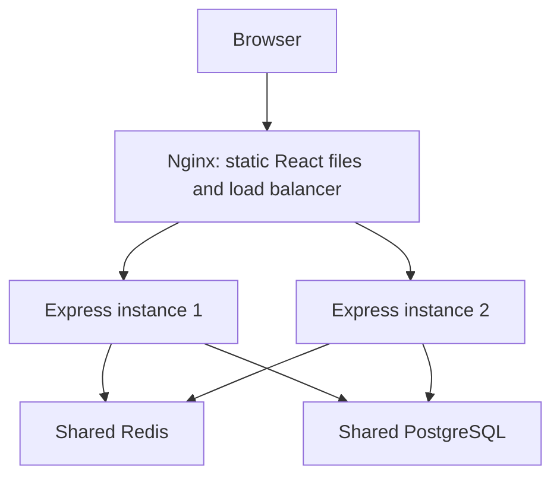

# Understand and explain the system

## Architecture actually implemented

Both Express instances run the same code. They share the JWT signing key and durable data. A login can hit instance 1 and the next request can hit instance 2: neither depends on an in-memory session. No sticky sessions are necessary.

Nginx serves the React build at `/`, sends `/api/*` to the APIs, and also sends short codes such as `/aB12xyZ` to the APIs. The browser receives a redirect and then visits the destination itself. Our server does not download the destination page.

## Files and their jobs

| File | Responsibility |
| --- | --- |
| `frontend/src/main.jsx` | UI, forms, loading/error states, list state, confirmation dialog |
| `frontend/src/api.js` | Fetch wrapper, Bearer token, single-flight refresh, logout |
| `frontend/src/style.css` | Responsive styling |
| `frontend/vite.config.js` | Development-only API proxy |
| `backend/src/index.ts` | Express middleware, authentication, link routes, cache, redirects |
| `backend/src/swagger.ts` | Interactive API reference |
| `backend/prisma/schema.prisma` | User, Url, RefreshToken models and indexes |
| `backend/prisma/migrations/` | Versioned SQL schema changes |
| `frontend/nginx.conf` | Frontend serving, round robin, forwarded IP, passive failover |
| `docker-compose.yml` | Two APIs, migration job, database, cache, web entry point |
| `deploy/` | Optional real-domain HTTPS deployment configuration |
| `scripts/smoke.mjs` | API integration checks against a running stack |

The API stays in one file with named sections to match the small existing project. Split into routes/services if it grows; adding layers now would not improve the learning goal.

## Request flow

**Create:** React form → `api('/urls', POST)` → Nginx → one Express instance → shared Redis limiter → verify JWT → validate destination → generate code → insert PostgreSQL row → return public short URL → refresh the list.

**Redirect:** browser GET `/code` → Nginx → one API → shared limiter → Redis GET. On a miss, read PostgreSQL and populate Redis for 60 seconds. Return `302 Location: destination` and `Cache-Control: no-store`. Increment clicks asynchronously in PostgreSQL.

**Edit/delete:** authenticate → look up record → check ownership → change DB → invalidate Redis. If Redis is unavailable, complete the DB mutation. A stale cached destination can survive until its TTL; an overlapping cache-miss fill can also reintroduce an older value. This implementation deliberately accepts bounded eventual consistency for mutable links. It does not promise immediate global revocation.

**Authentication:** passwords use bcrypt; login issues a 15-minute signed JWT and a random seven-day refresh token. Only the refresh token's SHA-256 hash is stored in PostgreSQL. Refresh consumes the old row and creates its replacement in one transaction. The conditional deletion prevents two concurrent requests from both reusing it. Existing plaintext tokens from the original implementation stop working; users sign in again after upgrading.

The frontend keeps tokens in sessionStorage, scoped to a browser tab. This is readable by JavaScript and therefore vulnerable to token theft through XSS. A stronger next step is an HttpOnly, Secure refresh cookie with an appropriate SameSite policy and CSRF controls, plus an in-memory access token. Logout revokes the refresh token; an already issued access token remains valid until expiration. Expired refresh-token rows need periodic cleanup in a long-running deployment.

## Design choices to discuss

| Choice | Why it is here | Limitation / alternative |
| --- | --- | --- |
| Random Base62, length 7 | Approximately 3.52 trillion possible strings; no distributed ID service | Random collisions remain possible; DB unique constraint plus up to five attempts handles them |
| PostgreSQL | Transactions, ownership queries, unique indexes | One primary is a bottleneck and failure point |
| Index `(userId, createdAt)` | Supports each user's recent-links list | Substring search still scans matching user data; add trigram search only when needed |
| Redis cache-aside | Avoid repeated destination lookups for popular links | Not a substitute for durable storage; stale reads are bounded by TTL |
| 302 + no-store | Browser returns to us on each navigation so destination edits and counting work | More traffic than a cached permanent redirect |
| Shared Redis rate limit | Users cannot multiply limits by hitting another app instance | Fixed windows allow boundary bursts; Redis eviction/restarts can reset limits |
| Round robin | Easy to demonstrate even request distribution | Equal request count does not mean equal CPU load; least-connections is an alternative |
| Asynchronous DB click increments | Keeps counting off the awaited response path | Best effort: crashes/errors lose counts; each click still causes a DB write |
| Two identical APIs | Demonstrates horizontal scaling and instance failover | Two containers on one VM do not survive VM failure |

The reference PDF also describes encoding a sequential globally unique ID into Base62. This project instead generates random Base62 strings. It does not hash the destination and does not implement an ID generator. Repeated destinations may receive different codes, which permits independent ownership and analytics.

## Failure behavior

- **One API stops:** Nginx detects connection failures, can retry eligible requests on the other API, and temporarily avoids the failing upstream. It uses passive health checks, not periodic active probes. A failed write may still return an error; the client must not assume exactly-once delivery.
- **Redis stops:** redirects fall back to PostgreSQL; normal API/redirect rate limiting fails open. Registration/login fail closed with 503 to avoid unlimited password attempts. Invalidation while Redis is down may leave stale entries when it returns, bounded by the original TTL.
- **PostgreSQL stops:** readiness fails; auth and management stop working. A cached redirect can still work while its best-effort click update fails.
- **Nginx or the host stops:** service is unavailable. A managed load balancer plus APIs on separate hosts is the next stage.
- **Docker reports unhealthy:** this does not itself restart a still-running container or remove it from Nginx. Nginx independently detects failures from real requests.

Connection budget: two APIs × a maximum of 10 Prisma connections gives up to 20 application connections, plus migration/admin connections. Increasing replicas increases total connections; it does not increase DB capacity.

## A demonstration you can give in an interview

1. Create a link and open it twice. Explain DB lookup on a cache miss versus Redis lookup on a hit.
2. Run `docker compose exec redis redis-cli --scan --pattern 'url:*'`, then `TTL url:YOUR_CODE` to inspect caching.
3. Refresh `/api/health` repeatedly, or run the command in the deployment guide. Show both instance names.
4. Run `docker compose stop backend1`; verify redirects still work. Restart it afterward.
5. Edit the destination; explain invalidation and the bounded-staleness caveat.
6. Explain why Redis rate limits and DB refresh tokens must be shared across replicas.

## Resume wording (after you run and demonstrate it)

- Built a full-stack URL shortener with React, TypeScript/Express, PostgreSQL, and Redis, supporting authenticated link management and click tracking.
- Containerized two stateless API instances behind an Nginx round-robin load balancer; implemented cache-aside redirects, shared rate limiting, and collision-safe short-code allocation.

Only add "deployed" once it is live. Do not add latency, uptime, requests-per-second, or scale claims without measurement. The PDF's traffic figures are design assumptions, not benchmark results for this project.

## References

- Nginx balancing and passive failures: https://nginx.org/en/docs/http/load_balancing.html
- Upstream configuration: https://nginx.org/en/docs/http/ngx_http_upstream_module.html
- Your attached URL-shortener HLD chapter informed the comparison between random codes, Base62 IDs, cache-aside reads, and redirects.
